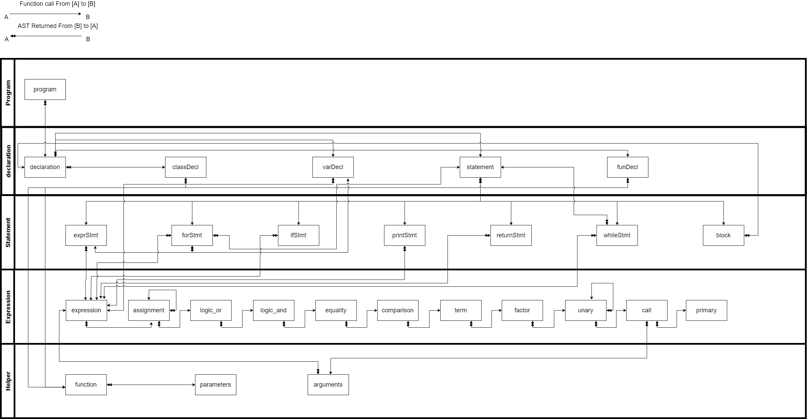

# Kotlin Implementation of Lox

## Table of Contents
1. [Architecture](#Architecture)
2. [Scanning](#Scanning)
3. [Parser](#Parser)
   1. [Grammar](#Architecture)
   2. [Tree](#Tree)
   3. [Visitor Pattern](#Visitor Pattern)
4. [Resolver](#Resolver)
5. [Interpreter](#Interpreter)

## Architecture
Pipe and filter. 
[graph here]

## Scanner
The first step is scanning(lexical analysis). A scanner takes in the linear stream of characters and produces tokens.

A Lox Token representation is as following:

| field name | field type |                                                           Comment                                                            |
|:----------:|:----------:|:----------------------------------------------------------------------------------------------------------------------------:|
|    type    | TokenType  |                            Type for each keyword, operator, bit of punctuation, and literal type                             |
|   lexeme   |   String   |                                          Raw character in the original input stream                                          |
|  literal   |    Any?    | Literal value of the token if any. Ex. Keywords like while has no literal value, "1" has a literal value different than 1 |
|    line    |    Int     |                        Location on where the token is located, for Klox only line number is recorded                         |

Check: [Token](./src/main/kotlin/Token.kt), [TokenType](./src/main/kotlin/TokenType.kt), [Scanner](./src/main/kotlin/Scanner.kt)

## Parser
In Lox, we use **recursive descent** as our parsing techniques. Recursive descent is considered a **top-down** parser because it starts from the top or outermost grammar rule and works its way down into the nested sub-rules before finally reaching the leaves of the syntax tree. It is essentially a literal translation of the grammar's rules straight nto imperative code. Each rule becomes a function. This descent is described as "recursive" when a grammar rule refers to itself, directly or indirectly, that translate to a recursive function call.

### Grammar
The complete Grammar for Lox is in [Grammar.md](./Grammar.md).

### Tree
A parser takes the flat sequence of tokens and builds a tree structure that mirrors the nested nature of the **grammar**. These trees have a couple of different names, parse tree or abstract syntax tree--depending on how close to the bare syntactic structure of the source language they are. In a **parse tree**, every single production becomes a node in the tree. An AST elides production that aren't needed by later phases.

Notice that Grammar and AST does not have a one-to-one relationship because this kind of eliding. 

Since we have the flexibility to define the structure, the author tailored the construction of AST specifically to the implementation needs. To make it a bit easier to track, the Node structure can be found in [Tree.md](./Tree.md)

When implementing, there are two classes created, [Stmt.kt](./src/main/kotlin/Stmt.kt) and [Expr.kt](./src/main/kotlin/Expr.kt). 

They are essentially just AST. There could be another abstract AST class created and the Stmt and Expr class will inherit from this AST class. But then this AST class will be purely a placeholder.

Also notice that the AST classes aren't owned by any single domain. Parser created those ASTs and interpreter consumes them. The very fact that trees span the border between those territories, means that the ASTs are not owned by either.

In fact these types exist to enable the parser and interpreter to communicate, making the AST to types that are simply data with no associated behavior.

### Visitor Pattern
The Visitor Pattern is really about approximating the functional style within an OPP language. The author offers a crystal clear example in the book. 

### Parsing
Notice that the parse() method returns a list of AST. In theory, the entire program can be parsed as one large AST, which represents the program. However, instead of doing so, we just pass in the list of statements directly.

Other than that, it is a chain of smartly implemented recursive function calls.

## Resolver
Resolver is part of the larger process called Static analysis. Essentially, for each identifier, the resolver find out where that name is defined and wire the two together.

Notice that the interpreter implicitly resolves a variable. To do so, the interpreter tracks down which declaration it refers to, each and every time the variable expression is evaluated. Notice that if the variable is inside a loop that runs a thousand times, that variable get re-resolved a thousand times.

A better solution is to resolve each variable use once. To do so, a new resolver class will inspect the user's program, finds every variable mentioned, and figures out which declaration each refers to. This is an example of a semantic analysis, wich figure out what pieces of the program actually mean.

After the parser produces the syntax tree, but before the interpreter starts executing it, the resolver will do a single walk over the tree to resolve all of the variables it contains. This sort of a static analysis is different from a dynamic execution:
- There are no side effects.
- There is no control flow.

The resolver need to visit every node in the syntax tree to traverse into the subtrees. However, only a few kinds of nodes are interesting when it comes to resolving variables:
- A block statement introduces a new scope for the statements it contains.
- A function declaration introduces a new scope for its body and binds its parameters in that scope.
- A variable declaration adds a new variable to the current scope.
- Variable and assignment expressions need to have their variables resolved. 

## Interpreter
At this stage, the interpreter has all the information it needs. To run the program, the interpreter traverses the syntax tree one branch and leaf at a time, evaluating each node as it goes. 
### Environment
In resolver, the concept was about scope, and each scope, in interpreter, corresponding to one environment. The outermost environment here is the global environment, which is not considered in the resolver phase. 

Essentially, resolver passes to the interpreter about how many number of scopes between the current innermost scope and the scope where the variable was found. So if the variable was found in the current scope, the value passed would be zero, which means the interpreter can find the variable in the current environment. If the variable is in the immediately enclosing scope, the value passed will be 1, which means interpreter can find it in the immediately enclosing environment. 

